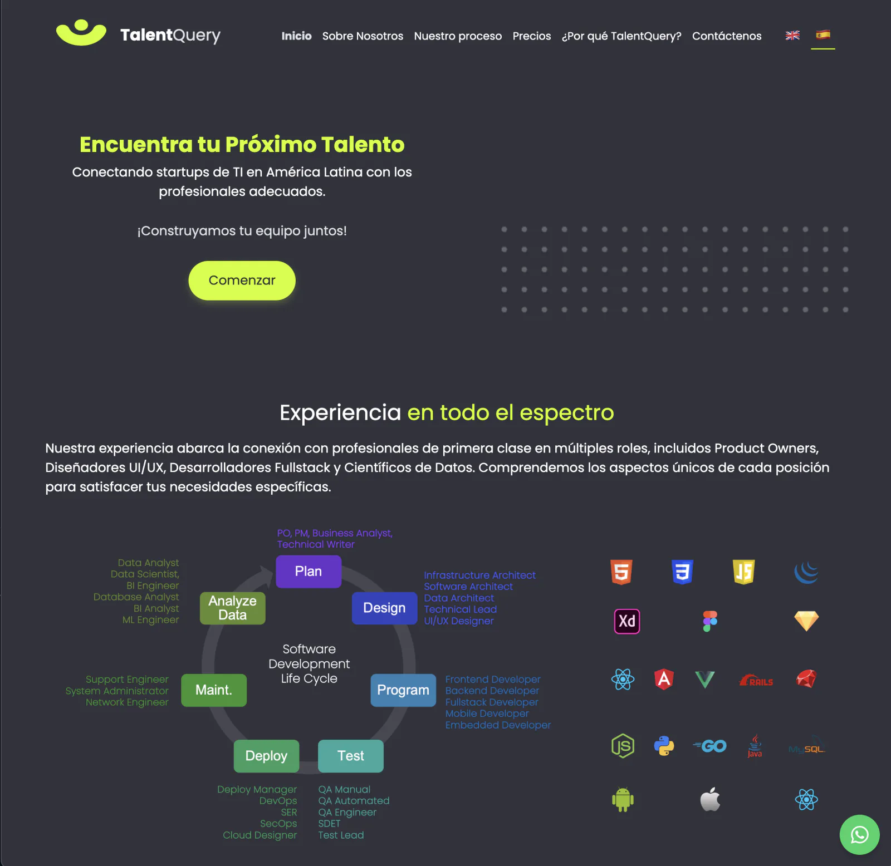

# 🦸🏻‍♂️ TalentQuery 🧑🏻‍💻

### Bilingual recruiting website + AI chatbot assistant for IT hiring conversations

TalentQuery is a marketing website for an IT recruiting agency focused on hiring in Latin America. It includes a bilingual experience (EN/ES), contact flows, and a chatbot endpoint powered by OpenAI so visitors can ask questions directly from the site.

---

## ✨ Features

| | Feature | What It Does |
|---|---|---|
| 🌍 | Bilingual content | Switches between English and Spanish using local JSON content files. |
| 🤖 | Chat assistant | Sends visitor questions to the backend `/chat` route and returns AI replies in the widget. |
| 📈 | Interactive stats | Renders hiring-market charts with Chart.js for the challenges section. |
| 📱 | Responsive layout | Mobile-friendly landing page sections built with Bootstrap + custom styles. |
| 📬 | Contact-first CTA flow | Email, WhatsApp, LinkedIn, and calendar booking links are built into the page. |

---

<p align="center">
  
</p>

---

## 🛠️ Tech Stack


---

## 🧩 Project Snapshot

- `client/` contains the static site (`index.html`), styles, scripts, language files, and assets.
- `server/server.mjs` serves the site, adds security headers/CORS, and handles the `/chat` endpoint.
- Chat uses the OpenAI API through an environment key (`OPENAI_API_KEY`) and returns plain JSON replies.
- `npm run build-css` compiles `client/css/custom.scss` into `client/css/custom.css`.

---

## 🚀 Live Demo

<p align="center">
  <a href="https://talentquery.onrender.com/" target="_blank" rel="noopener noreferrer">
    
  </a>
</p>

---

## 💻 Run it locally

```bash
git clone https://github.com/jorguzman100/talentquery.git
cd talentquery
npm install
cp .env_example .env
npm run build-css
npm start
```

Local URL:

- App (site + API): `http://localhost:3000`

<details>
<summary>🔑 Required environment variables</summary>

```env
# .env
OPENAI_API_KEY=
PORT=3000

# Optional
OPENAI_MODEL=gpt-4o-mini
ALLOWED_ORIGINS=http://localhost:3000,https://talentquery.io,https://www.talentquery.io,https://talentquery.onrender.com
```
</details>

---

## 🤝 Contributors

- **Jorge Guzman** · [@jorguzman100](https://github.com/jorguzman100)
